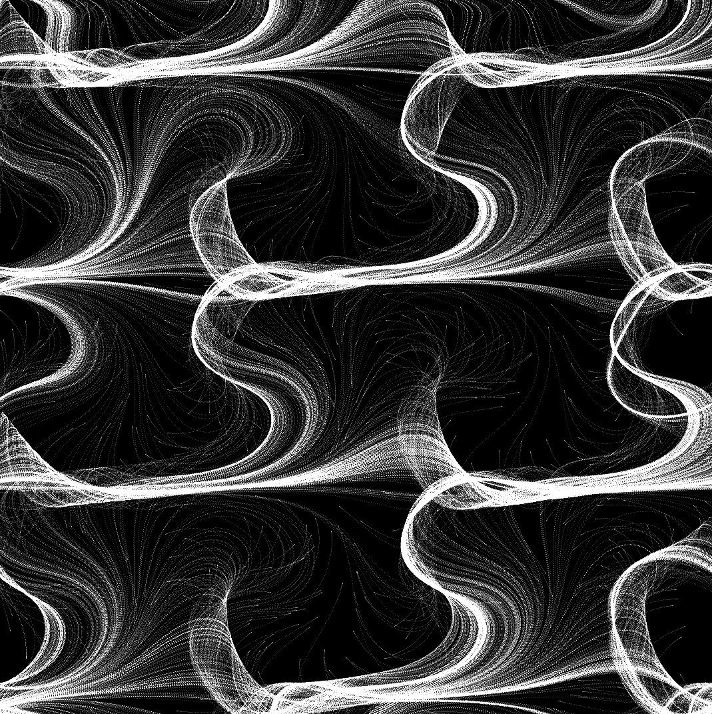
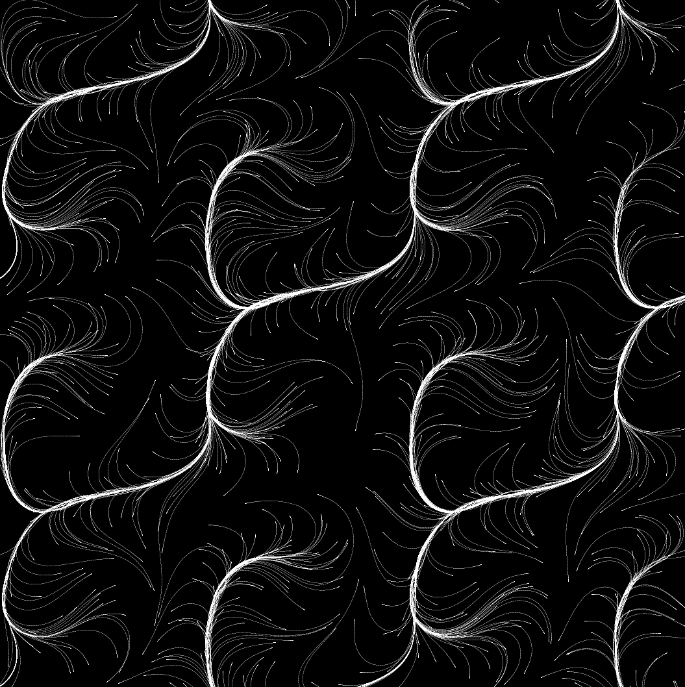
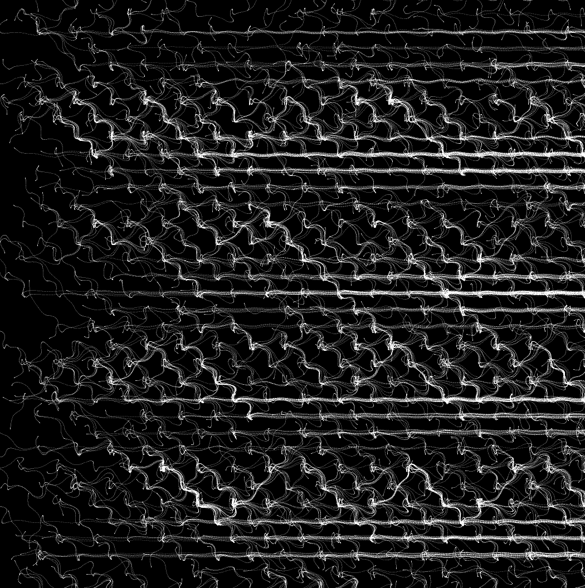
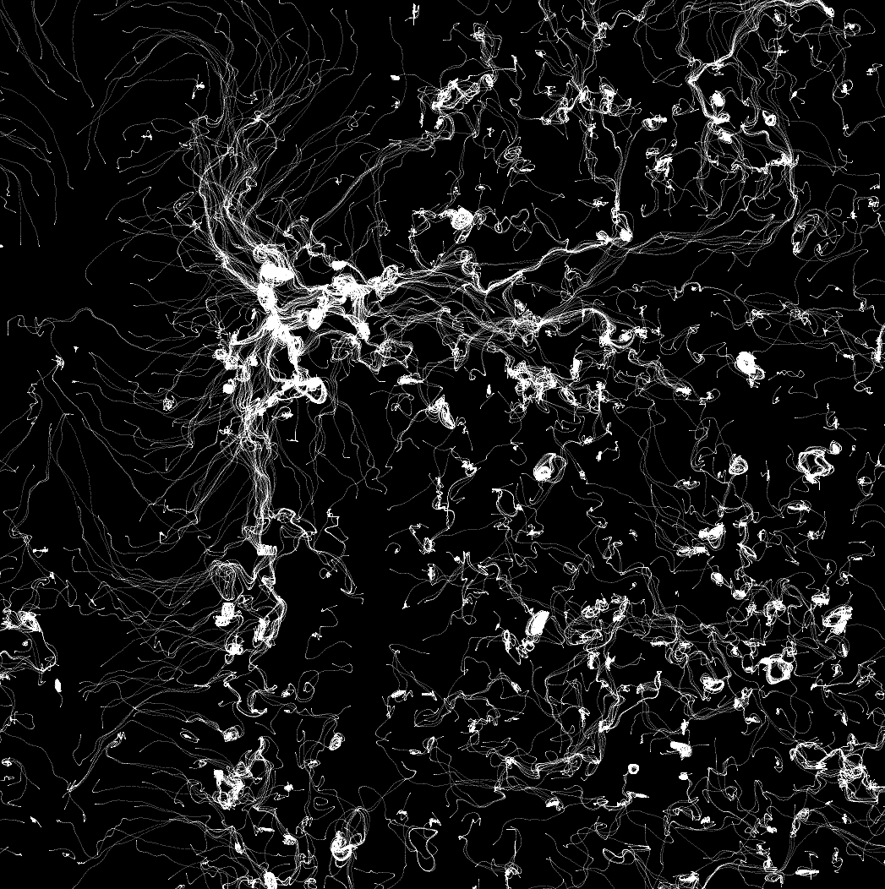
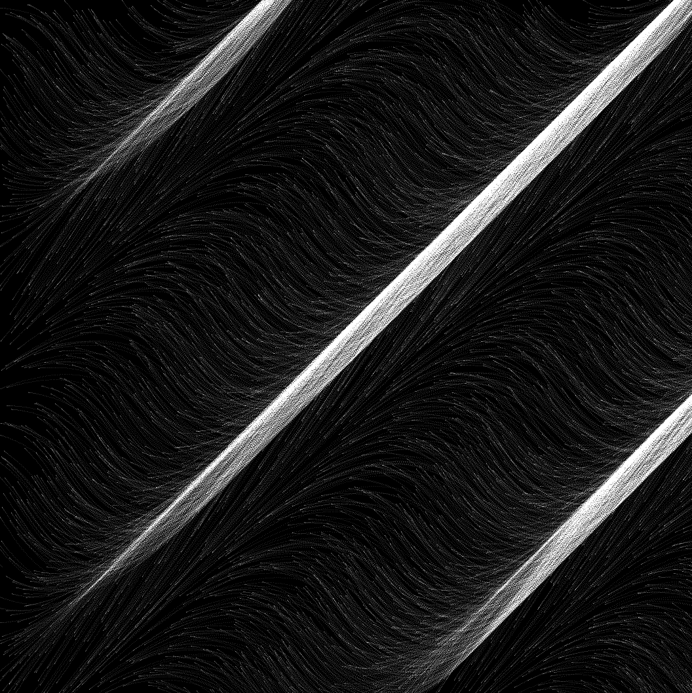
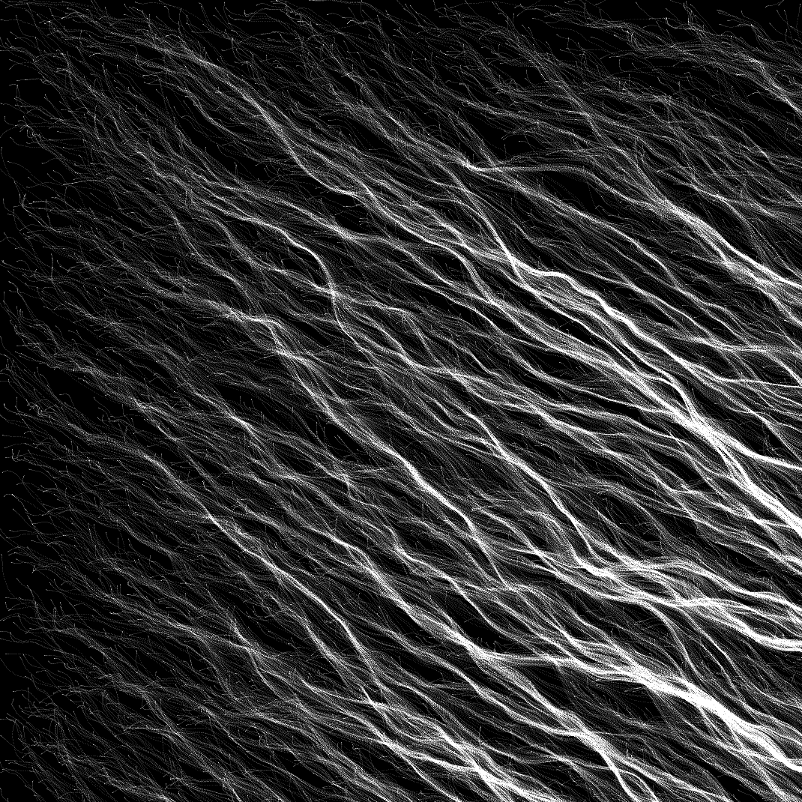
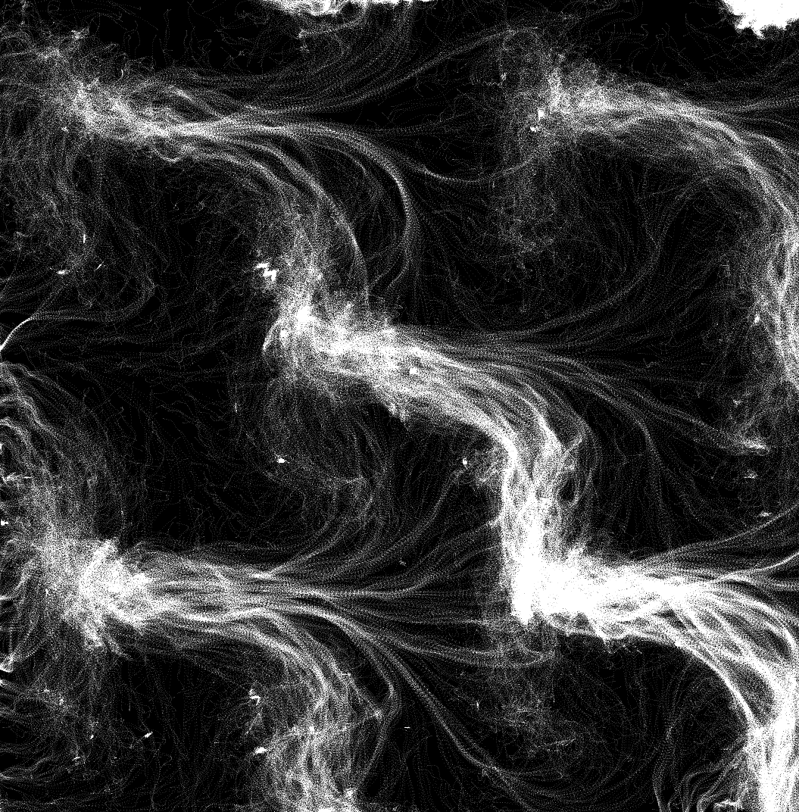

# Generative Art

### Description

Code in projects/VS2022/raylib_game/..

### Controls

Click buttons 1,2,3,4,5 to try different outputs

### Screenshots

### License

This game sources are licensed under an unmodified zlib/libpng license, which is an OSI-certified, BSD-like license that allows static linking with closed source software. Check [LICENSE](LICENSE) for further details.

*Copyright (c) 2025 Guillem Serra*
